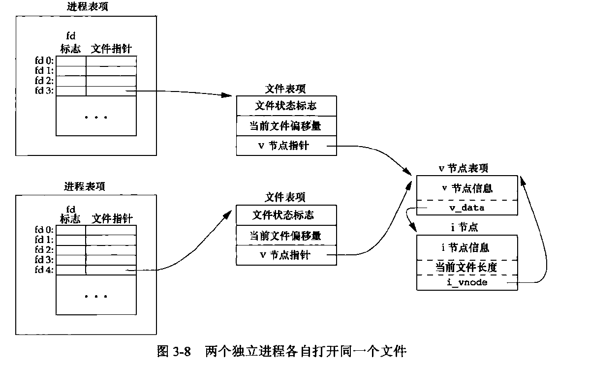

# 文件I/O
## 1. 引言
先讲述可用的文件I/O函数--打开文件, 读文件, 写文件等。具体常用的I/O操作函数  
有5个: open(), read(), write(), lseek(), 以及close()。
本章描述的函数经常被称为 *不带缓冲*的I/O。术语 *不带缓冲*指的是每个read和write  
都调用内核中一个系统调用。这些不带缓冲的I/O函数不是ISO C的组成部分。但是, 它们是  
POSIX.1和Single UNIX Specification的组成部分。

## 2. 文件描述符
文件描述符是一个非负整数。在打开一个现有文件或创建一个新文件时, 内核会返回一个文件  
描述符。

> 1. 文件描述符0 -- 标准输入
> 2. 文件描述符1 -- 标准输出
> 3. 文件描述符2 -- 标准错误

*PS*: 符合POSIX.1的应用程序中, 幻数0, 1, 2 被替换成符号常量 **STDIN_FILENO, STDOUT_FILENO, 
STDERR_FILENO**以提高可读性。常量都定义在< unisted.h >中定义。

文件描述符的变化范围是 0～OPEN_MAX-1。。。

## 3. 函数open() 和 openat() 
```c
#include<fcntl.h>
int open (const char *path, int oflag, ... /* mode_t mode */);
int openat (int fd, const char *path, int oflag, ... /* mode_t mode */);
                                                /* 返回值: 若成功, 返回文件描述符;若出错, 返回-1 */
```
分析: 
####　*path* : 打开或创建文件的名字。
####　*oflag*: 说明此函数的多个选项。

> oflag参数 | 说明
> --------- | ----
> O_RDONLY  | 只读打开
> O_WRONLY  | 只写打开
> O_RDWR    | 读, 写打开
> O_EXEC    | 只执行打开
> O_SEARCH  | 只搜索打开(应用于目录)
> 
> **以上5个常量中必须指定一个且只能指定一个**
> 
> oflag参数   | 说明
> ---------   | ----
> O_APPEND    | 每次写时都追加到文件尾端
> O_CLOEXEC   | 把FD_CLOEXEC常量设置为文件描述符标志
> O_CREAT     | 文件创建选项, 需要通过mode参数设置文件权限
> O_DIRECTORY | 如果path引用的不是目录, 则出错
> 0_EXCL      | 用于判断文件是否存在以及将测试和创建两者成为一个原子操作
> O_NOCTTY    | 如果path引用的是终端设备, 则不将该终端分配为控制终端
> O_NOFOLLOW  | 如果path引用的是符号链接, 则出错
> O_NONBLOCK  | 如果path引用的是FIFO, 快特殊文件, 字符特殊文件, 则将文件此后的I/O操作设为非阻塞方式
> O_SYNC      | 使每次WRITE等待物理I/O操作完成, 包括了WRITE引起的属性更新的I/O操作
> O_TRUNC     | 如果文件存在, 且为只写或读写成功打开, 则将其长度截断为0
> O_TTY_INIT  | 如果打开一个未打开的终端设备, 设置非标准的termios值
> O_DSYNC     | 同O_SYNC, 不过不需要等待文件属性更新
> O_RSYNC     | 同O_SYNC, 不过是等待READ操作
> 
> **以上常量是可选的, 其中最后两个来自于SUS(以及POSIX.1)的同步输入和输出选项的一部分**

####　*fd*   : 通过fd将open和openat区分开来
> 1. path 指的是绝对路径, fd忽略。openat相当于open
> 2. path 指的是相对路径, fd指出了相对路径的起始地址, fd通过打开相对路径名所在的目录获取
> 3. path 指的是相对路径, fd具有特殊值AT_FDCWD, 路径名在当前工作目录获取, openat在操作上与open类似

#### 文件名和路径名截断
POSIX.1 中常量_POSIX_NO_TRUNC有效时, 路径名超过PATH_MAX, 或者路径名中任一文件名超过NAME_MAX, 出错返回,  
并将errno设置为ENAMETOOLONG。

## 4. 函数 creat() 
```c
#include <fcntl.h>
int creat (const char *path, mode_t mode);
                /* 返回值: 若成功, 返回只写文件的文件描述符;若出错, 返回-1 */
```
PS:此函数等效于open(path, O_WRONLY | O_CREAT | O_TRUNC, mode);

**缺陷:**
它以只写方式创建文件, 所以要创建一个临时文件并要先写该文件再读该文件, 则必须先调用creat, close, open。
不过现在可以通过调用 open (path, O_RDWR | O_CREAT | O_TRUNC, mode);

## 5. 函数 close() 
```c
#include <unistd.h>
int close (int fd);
    /* 返回值: 若成功, 返回0;若出错, 返回-1 */
```

关闭一个文件时, 会释放该进程加在该文件上的[记录锁](http://blog.csdn.net/todd911/article/details/18654693), 此外进程终止时, 内核自动关闭它所有的打开文件  
所以可以不显式地用close关闭打开文件。

## 6. 函数 lseek() 
```c
#include <unistd.h>
off_t lseek (int fd, off_t offset, int whence);
    /* 返回值: 若成功, 返回新的文件偏移量;若出错, 返回-1 */
```

#### 分析offset参数和whence的值
* 若whence是SEEK_SET; 则将文件的偏移量设置为距文件开始处offset字节。
* 若whence是SEEK_CUR; 则将文件的偏移量设置为当前值加上offset, offset可正可负。
* 若whence是SEEK_END; 则将文件的偏移量设置为文件长度加上offset, offset可正可负。

```c
off_t currpos;
currpos = lseek (fd, 0, SEEK_CUR);
```
以上代码可用来确定打开文件的偏移量, 可用来确定所涉及的文件是否可以设置偏移量。  
如果文件描述符指向的是一个管道, FIFO或网络套接字, 则lseek返回-1, 并将errno设置为  
ESPIPE。

#### 说明
虽然通常文件偏移量是一个非负整数, 但是某些设备也允许负的偏移量, 但对于普通文件,其偏移量一定是非负值。  
不过由于偏移量可能为负值, 所以比较lseek的返回值的时候不能测试它是否小于0, 而是谨慎地比较它是否等于-1。

## 7. 函数read()

```c
#include <unistd.h>
ssize_t read (int fd, void *buf, size_t nbytes);
    /* 返回值: 若成功, 返回读到的字节数;若出错, 返回-1 */
```

#### 以下情况读到的字节数少于要求读的字节数

- 读普通文件, 在读到要求的字节数之前已经到达文件尾端;
- 从终端设备读的时候, 通常一次只能读一行;
- 从网络读时, 网络中的缓冲机制可能造成返回值小于要求的字节数;
- 从管道或FIFO读时, 管道中包含的字节数少于要求的字节数;
- 从某些面向记录的设备读时, 一次最多返回一个记录;
- 当一信号造成中断时, 而已经读了部分数据时;

## 8. 函数write()

```c
#include <unistd.h>
ssize_t write (int fd, const void *buf, size_t nbytes);
    /* 返回值: 若成功, 返回已写的字节数;若出错, 返回-1 */
```

其返回值通常与参数nbytes的值相同, 否则表示出错。write出错常见原因是磁盘已满或超出给定的文件长度限制。

## 9. I/O的效率
大多数文件系统为改善性能都采用某种 **预读**技术, 当检测到正进行顺序读取时, 系统就是图读入比应用要求的更多数据,  
并假想应用很快会读这些数据。

## 10. 文件共享(重点难点)

### 1. 概述
内核用3中数据结构(其实都是链表结构)表示打开文件。  
1. 每个进程在进程表中都有一个记录项, 记录项中包含一张打开文件描述表。与文件描述符相关联的是:  
    1. 文件描述符标志;
    2. 指向一个文件表项的指针;
2. 内核为所有打开文件维持一张文件表, 每个文件表项包含:  
    1. 文件状态标志(读, 写, 添写, 同步和非阻塞等);
    2. 当前文件偏移量;
    3. 指向该文件v节点表项的指针;
3. 每个打开的文件(或设备)都有一个v节点(v-node)结构, 它包含:
    1. 文件类型;
    2. 对此文件进行各种操作函数的指针;
    3. 该文件的i节点(i-node, 索引节点);[这一项针对于大多数文件]

PS: i节点包含了:   
1. 文件的所有者;
2. 文件长度;
3. 指向文件的是指数据块在磁盘上的所在位置的指针;
4. MORE;

理解:  
对于文件表项来说, v节点表项存储了文件的具体信息; 而对大多数文件来说,  
它们将文件的具体信息存储到了i节点表项中。也就是说v-node和i-node是一一对应的。  
对于一个给定的文件只有一个v节点表项。特别的, 在Linux中使用了通用的i节点结构,  
没有了v节点。不过虽然实现不同, 大体原理和思想上是类似的。

### 2. 实例分析
对于两个进程各自打开了同一个文件, 有以下关系:  



当我们假设第一个进程在文件描述符3上打开该文件, 另一个进程在文件描述符4上打开该文件。  
打开该文件的每个进程都获得了各自的一个文件表项, 并且指向同一个v-node表项。之所以, 每  
个进程都有一个文件表项, 是因为每个进程都有自己对该文件的当前偏移量。

#### 几点说明
- 完成一次write之后, 在文件表项中的文件当前偏移量增加写入的字节数。如果这导致当前文件偏移量  
超过了当前文件长度, 即将i-node中的文件长度设置为当前文件偏移量。
- 如果用O_APPEND标志打开一个文件, 则相应标志也被设置到了文件表项的文件状态标志中。每次对这种  
具有追加写标志的文件执行写操作时, 文件表项中的当前偏移量会首先被设置为i-node表项的文件长度。
- 若一个文件用lseek定位到文件当前的尾端, 则文件当前偏移量被设置为i-node表项中的文件长度。(这与O_APPEND是不同的)  
- lseek函数只修改文件表项的文件偏移量, 不进行I/O操作。
- 文件描述符和文件状态标志在作用范围的区别, 前者只作用于一个进程, 而后者应用于指向该文件表项的所有进程的所有描述符。  

## 11. 原子操作
### 原子操作之必要性

```c
/* 早期没有O_APPEND标志时, 将数据追加到文件尾端的方法 */
if (lseek (fd, 0L, 2) < 0)
    err_sys ("lseek error");
if (write (fd, buf, 100) != 100)
    err_sys ("write error");
```

Eg: 假定两个独立的进程A和B都通过上述方法对同一个文件进行了追加写操作。则此时的各个数据结构之间关系如图3-8所示。  
如果进程A调用了lseek之后将该文件的当前偏移量设为当前文件的文件长度(假设为1500)。然后内核调用了B进程, B进程先调用  
了lseek, 也将偏移量设为文件长度(1500); 然后调用了write, 它写入数据同时将偏移量增加了100, 即文件长度增加了(变成了1600),  
v-node中的文件长度也更新了。然后内核重新恢复A进程, A开始调用write时就从当前的文件偏移量(1500)处开始写入数据, 这样  
覆盖掉B进程写入的数据。

#### 分析
上述例子的问题出在将逻辑操作"先定位, 然后写", 它使用了两个分开的函数调用, 这样内核随机调用进程就可能将两个函数调用  
分开调用, 从而产生错误。既然如此, 解决方案也是显而易见, 将两个分开的函数调用合并为一个。这就是O_APPEND标志的作用, 这  
也是"原子操作"基本思想。

### 原子操作的一些实现: 函数pread(), 函数pwrite()

```c
#include <unistd.h>
ssize_t pread (int fd, void *buf, size_t nbytes, off_t offset);
    /* 返回值: 若成功, 返回读到的字节数, 若已到文件尾, 返回0;若出错, 返回-1 */
ssize_t pwrite (int fd, const void *buf, size_t nbytes, off_t offset);
    /* 返回值: 若成功, 返回已写的字节数;若出错, 返回-1 */
```
*说明* (调用pread和pwrite与普通的先调用lseek后调用read或write的区别)
- 对于逻辑操作思想上, 两者是相同的。pread和prwrite的实现就是后面逻辑操作的实现  
不过调用pread或pwrite时, **无法中断其定位和读写操作**。
- 不会更新当前文件偏移量。

### 创建文件
在没有O_CREAT和O_EXCL选项时, 创建文件操作是通过下面的代码实现的。  
```c
if ((fd = open (pathname, O_WRONLY)) < 0) {
    if (errno == ENOENT)
        if ((fd = creat (path, mode)) < 0)
            err_sys ("creat error");
} else {
    err_sys ("open error");
}
```
这样操作的风险是显而易见的将创建文件分成两个函数调用来实现, 在多进程调用时就会数据覆盖的问题。  
而O_CREAT和O_EXCL的出现就是将两者合并为一个函数调用, 即为 **原子操作**。

*原子操作指的是由多步组成的一个操作。如果该操作原子地执行, 则要么执行完所有步骤, 要么不执行,   
不可能只执行所有步骤的一个子集。*

## 12. 函数dup()和dup2()

```c
#include <unistd.h>
int dup (int fd);
int dup2 (int fd, int fd2);
    /* 返回值: 若成功, 返回新的文件描述符;若出错, 返回-1 */
```

### 说明
- 由dup返回的新文件描述符一定是当前可用的文件描述符中的最小的一个;
- 对于dup2, 可以通过fd2指定新描述符的值。如果fd2已经打开, 则现将其关闭。  
若fd等于fd2, 则dup2返回fd2, 而不关闭它。否则, fd2的FD_CLOEXEC标志就被清除,  
这样fd2在进程调用exec函数时就是打开状态;
- 这些函数返回的新的文件描述, 与fd共享同一个文件表项;

```c
// 调用dup();
dup (fd);
// 等效于
fcntl (fd, F_DUPFD, 0);

// 调用dup2();
dup2 (fd, fd2);
// 等效于
close (fd2);
fcntl (fd, F_DUPFD, fd2);
```

fcntl()也可以用来复制文件描述符, 在后一种情况下dup2不完全等同于close加上fcntl:   
- dup2是一个原子操作, 而close加上fcntl是两个函数的调用;
- dup2和fcntl有一些不同的errno。

## 13. 函数sync(), fsync() 和 fdatasync()
传统的UNIX系统实现在内核中设有缓冲区 *高速缓存*或 *页高速缓存*, 大多数磁盘I/O都通过缓冲区进行,  
当进行文件写时, 内核先将数据复制到缓冲区, 然后排入队列晚些时候再写入磁盘。即为 **延迟写**。
当重用缓冲区存放其他数据时, 它会把所有的延迟写数据写入磁盘。为了保证磁盘上实际文件系统与缓冲区上  
的数据一致。UNIX提供了下面3个函数: 

```c
#include <unistd.h>
int fsync (int fd);
int fdatasync (int fd);
    /* 返回值: 若成功, 返回0; 若出错, 返回-1 */
void sync (void);
```

### 说明
- sync只将所有修改过的块缓冲区写入队列, 然后返回并不等待实际写磁盘操作的结束;
(系统守护进程update周期性的调用sync函数, 从而实现定期冲洗内核的块缓冲区。命令sync(1)也调用了sync函数)
- fsync只对文件描述符fd指定的文件生效。并等待写磁盘操作结束;
(fsync可以用于类似于数据库的应用程序, 这类应用程序需要确保修改过的块立即写到磁盘上)
- fdatasync类似于fsync, 但它只影响文件的数据部分。fsync在更新数据的同时还会更新文件属性;

## 14. 函数fcntl()
```c
#include <fcntl.h>
int fcntl (int fd, int cmd, ... /* int arg */);
    /* 返回值: 若成功, 则依赖于cmd; 若出错, 返回-1 */
```
*PS:第3个参数总是一个整数,不过在遇到记录锁时,它指向一个结构的指针*

### 说明
fcntl的功能总体有5种:  
- 复制一个已有的文件描述符  (cmd = F_DUPFD or F_DUPFD_CLOEXEC)
- 获取/设置文件描述符标志   (cmd = F_GETFD or F_SETFD)
- 获取/设置文件状态标志     (cmd = F_GETFL or F_SETFL)
- 获取/设置异步I/O所有权    (cmd = F_GETOWN or F_SETOWN)
- 获取/设置记录锁           (cmd = F_GETLK, F_SETLK or F_SETLKW)

**分析**:  
1. F_DUPFD: 函数功能同DUP()函数;
2. F_DUPFD_CLOEXEC: 在F_DUPFD的基础上更改文件的FD_CLOEXEC标志的值;
3. F_GETFD: 返回文件的FD值;
4. F_SETFD: 对FD设置文件描述符标志, 新标志值按第3个参数(取为整型值)设置;
5. F_GETFL: 返回对应于FD的文件状态标志, 不过由于5个访问方式标志互斥。所以  
必须首先用屏蔽字O_ACCMODE取得访问方式位, 然后结果与5个标志位依次比较;
6. F_SETFL: 将文件状态标志设为第3个参数的值(候选值: O_APPEND, O_NONBLOCK, O_SYNC, O_DSYNC, O_RSYNC, O_FSYNC, O_ASYNC);
7. F_GETOWN: 获取当前接收SIGIO和SIGURG信号的进程ID或进程组ID;
8. F_SETOWN: 设置接收SIGIO和SIGURG信号的进程ID或进程组ID, 正的arg指定的是进程ID, 负的arg指定的进程组ID;

*PS:对于Linux系统来说, O_SYNC标志没有起到作用;即Linux系统不允许我们用fcntl设置O_SYNC标志。*

## 15. 函数ioctl
```c
#include <unistd.h>   /* System V */
#include <sys/ioctl.h>   /* BSD and Linux */
int ioctl (int fd, int request, ...);
    /* 返回值: 若成功, 返回其他值; 若出错, 返回-1 */
```

### 说明
ioctl函数是I/O操作的"杂货箱", 不能用本章中其他函数表示的I/O操作通常用ioctl表示, 终端I/O是使用ioctl最多的地方。
另外, 对于ioctl函数来说, 函数声明时的头文件只是函数自身要求的头文件。通常, 还要求另外的设备专用头文件。依据不同的  
设备操作来调用不同的头文件。

## 16. /dev/fd
较新的系统都提供名为/dev/fd的目录, 其目录项是名为0, 1, 2等的文件。打开文件/dev/fd/n等效于复制描述符n(假定描述符n是打开的)。  
即:  

    fd = open ("/dev/fd/0", mode);
等效于

    fd = dup(0);
此外, 也可以用/dev/fd作为路径名参数调用的creat, 这与调用open时用O_CREAT作为第2个参数是等效的。

**Linux系统中的/dev/fd是个例外。它把文件描述符映射成指向底层物理文件的符号链接。因此返回的新文件描述符的模式与/dev/fd文件  
描述符的模式并不相关**
