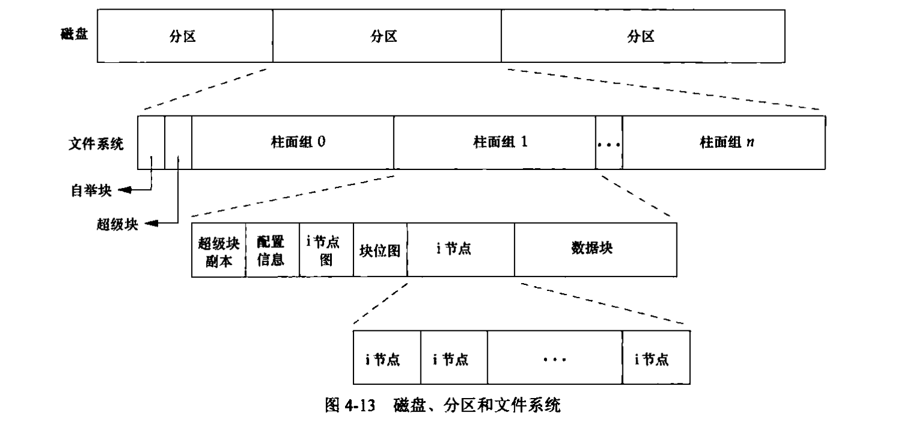
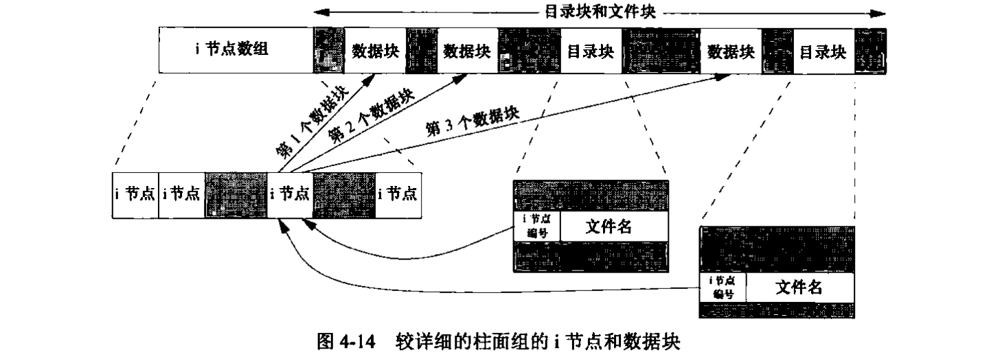
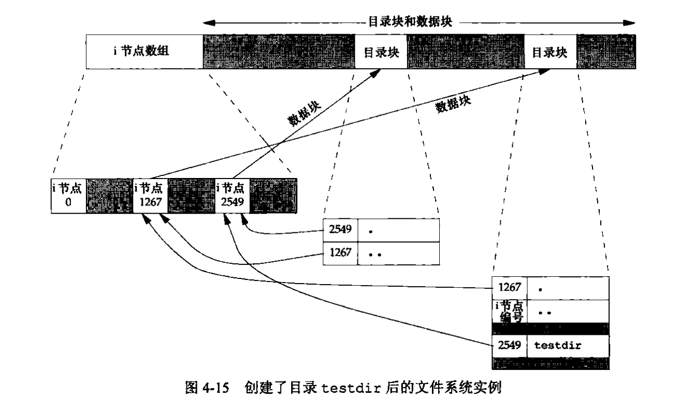
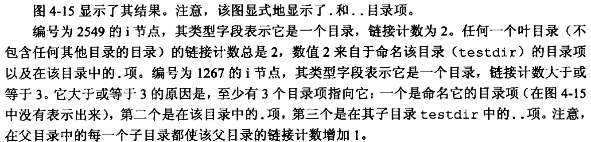

# 4. 文件和目录
## 1. 函数stat(), fstat(), fstatat()和lstat()
```c
#include <sys/stat.h>
int stat (const char *restrict pathname, struct stat *restrict buf);
int fstat (int fd, struct stat *buf);
int lstat (const char *restrict pathname, struct stat *restrict buf);
int fstatat (int fd, const char *restrict pathname, struct stat *restrict buf, int flag);
    /* 所有4个函数的返回值: 若成功, 返回0; 若出错, 返回-1 */
```
### 说明
给定pathname:  

函数 | 作用
---- | ----
stat | 返回命名文件有关的信息结构, 面对符号链接时, 返回链接引用文件的有关信息
fstat | 获得描述符fd上打开的文件的信息结构
lstat | 与stat作用类似, 不过面对符号链接时, 返回的是链接的有关信息
fstatat | 为一个相对于当前目录(由fd参数指向)的路径名文件统计信息, flag控制是否跟随符号链接

**关于fstatat()函数的一些补充说明**
AT_SYMLINK_NOFOLLOW -- 不跟随符号链接, 只返回链接本身的信息; 默认情况下, 返回链接引用文件的有关信息。  
当fd被设置为AT_FDCWD时, 若pathname是相对路径名, fstatat计算相对于当前目录的pathname参数; 若pathname是  
绝对路径, 则根据flag的参数, fstatat()的作用和stat, lstat一样。

### stat结构 (参数buf)
```c
struct stat {
    mode_t              st_mode,         /* file type & mode (permissions) */
    ino_t               st_ino,          /* i-node number (serial number) */
    dev_t               st_dev,          /* device number (file system) */
    dev_t               st_rdev,         /* device number for special files */
    nlink_t             st_nlink,        /* number of links */
    uid_t               st_uid,          /* userID of owner */
    gid_t               st_gid,          /* groupID of owner */
    off_t               st_size,         /* size in bytes, for regular files */
    struct timespec     st_atime,        /* time of last access */
    struct timespec     st_mtime,        /* time of last modification */
    struct timespec     st_ctime,        /* time of last file status change */
    blksize_t           st_blksize,      /* best I/O block size */
    blkcnt_t            st_blkcnt,       /* number of disk blocks allocated */
};
```
## 2. 文件类型
Unix的文件类型主要是普通文件和目录。但依旧有其他的文件类型, 总结如下: 

文件类型 | 说明
-------- | ----
普通文件 | 最常用的文件形式, 包含了某种形式的数据
目录文件 | 包含了其他文件的名字以及指向与这些文件有关信息的指针
块特殊文件 | 提供对设备带缓冲的访问, 每次访问长度固定不变
字符特殊文件 | 提供对设备不带缓冲的访问, 每次访问长度可变
FIFO | 用于进程间的通信, 也被称为命名管道
套接字 | 用于进程间的网络通信, 也可以用于一台宿主机上进程之间的非网络通信
符号链接 | 指向另一个文件

### 补充
1. 对于普通文件来说, 数据是文本还是二进制数据对内核来说没有区别。不过对于二进制可执行文件, 为了便于执行程序。  
内核必须理解其格式。
2. 目录文件的读权限指的是可以读取目录中所包含的文件, 只有内核可以直接写目录。进程必须使用特定函数。
3. FreeBSD不再支持块特殊文件, 对设备的所有访问都是通过字符特殊文件进行。
4. 文件类型的信息包含在 *stat* 结构的 **st_mode**成员中。
5. POSIX.1允许实现将进程间通信(IPC)对象说明为文件。

以下是一些用于在st_mode中确定文件类型的宏:   

宏 | 文件类型
-- | -------
S_ISREG() | 普通文件
S_ISDIR() | 目录文件
S_ISCHR() | 字符特殊文件
S_ISBLK() | 块特殊文件
S_ISFIFO() | 管道或FIFO
S_ISLNK() | 符号链接
S_ISSOCK() | 套接字
S_TYPEISMQ() | 消息队列
S_TYPEISSEM() | 信号量
S_TYPEISSHM() | 共享存储对象

**PS:早起的UNIX版本不提供S_ISxxx的宏, 可以通过将st_mode与屏蔽字S_IFMT进行逻辑与运算, 然后与名为S_IFxxx的常量比较得出。**

## 3. 设置用户ID和设置组ID
与一个进程有关的ID种类: 
- 实际用户ID;
- 实际组ID;
- 有效用户ID;
- 有效组ID;
- 附属组ID;
- 保存的设置用户ID;
- 保存的设置组ID;

### 分析: 
- 实际用户ID和实际组ID表示了我们的身份, 这两个字段在登录时取自口令文件。
- 有效用户ID, 有效组ID以及附属组ID决定了文件访问权限。
- 保存的设置用户ID和保存的设置组ID在执行一个程序时包含了有效用户ID和有效组ID的副本。
- 通常情况下有效用户ID等于实际用户ID, 有效组ID等于实际组ID。
- 每个文件有一个所有者和组所有者, 其中所有者由stat结构中的st_uid结构指定, 组所有者由st_gid结构指定。
- 在st_mode中也可以设置一个特殊标志, 其含义是 _当执行此文件时, 将进程的有效用户ID设置为文件所有者用户ID_;
与此类似的也有另一位可以在执行时将进程的有效组ID设置为文件的组所有者ID。这两位即为: 设置用户ID和设置组ID

## 4. 文件访问权限
不论什么类型的文件, 它的访问权限位都有9个: 

st_mode 屏蔽 | 含义
------------ | ----
S_IRUSR | 用户读
S_IWUSR | 用户写
S_IXUSR | 用户执行
S_IRGRP | 组读
S_IWGRP | 组写
S_IXGRP | 组执行
S_IROTH | 其他读
S_IROTH | 其他写
S_IROTH | 其他执行

_chmod(1)命令用于修改这九个权限位, 该命令允许我们用u表示用户, 用g表示组, 用o表示其他。_

### 权限位的使用方式
- 当我们用名字打开任一类型的文件时, 对该名字中包含的每一个目录, 以及它可能隐含的当前工作目录  
都应该具有执行权限。
- 目录的读权限和执行权限区别在于。读权限允许我们读目录时, 获得在此目录中的文件名列表; 执行权限使  
我们在访问文件时, 可以通过文件路径名中的目录(即为搜索该目录, 寻找一个特定的文件名);
- 文件的读权限决定了我们是否可以打开现有文件进行读操作。这与open()函数的O_RDONLY和O_RDWR标志有关;
- 文件的写权限决定了我们是否可以打开现有文件进行写操作。这与open()函数的O_WRONLY和O_RDWR标志有关;
- 若要在open()函数中对一个文件指定O_TRUNC标志。必须要有该文件的写权限;
- 在目录中创建文件, 必须要拥有目录的写权限和执行权限;
- 删除一个现有文件, 必须拥有文件所在目录的写权限和执行权限, 对文件本身不需要读, 写权限;
- 若用7个exec函数中的任何一个执行某个文件, 必须要文件的有执行权限, 此外该文件必须是普通文件;

__进程访问一个文件时进行的权限测试:__
测试涉及了, 文件的所有者(st_uid和st_gid), 进程的有效ID(有效用户ID和有效组ID)以及进程的附属组ID;
1. 若进程的有效用户ID是0(超级用户), 则允许访问。
2. 若进程的有效用户ID等于文件所有者的ID(即进程拥有该文件), 若所有者的适当的访问权限位被设置, 则允  
许访问, 否则拒绝访问;
3. 若进程的有效组ID或附属组ID之一等于文件的组ID, 若组的适当的访问权限位被设置, 则允许访问, 否则拒  
访问;
4. 若其他用户适当的访问权限位被设置, 则允许访问, 否则拒绝访问;

__适当的访问权限: 若进程为读而打开该文件, 则用户读位应为1; 若进程为写而打开该文件, 则用户写位应为1;   
若进程为执行而打开该文件, 则用户执行为应为1。__

## 5. 新文件和目录的所有权
新文件和目录的所有权遵循下面的规则:  
1. 新文件的用户ID设置为进程的有效ID;
2. 新文件的组ID可以是进程的有效组ID;
3. 新文件的组ID也可以是它所在目录的组ID;
4. 新文件的组ID取决于它所在目录的设置组ID位是否设置。若设置了, 则遵循规则3; 否则, 遵循规则2;
(新目录遵循的规则同上)

## 6. 函数access()和faccessat()
```c
#include <unistd.h>
int access (const char *pathname, int mode);
int faccessat (int fd, const char *pathname, int mode, int flag);
        /* 返回值: 若成功, 返回0; 若失败, 返回-1 */
```
**函数作用: 按实际用户ID和实际组ID进行访问权限测试**

### 函数参数说明
mode | 说明
---- | ----
F_OK | 测试文件是否存在
R_OK | 测试写权限
W_OK | 测试读权限
X_OK | 测试执行权限

- 当pathname是绝对路径时, 或者fd的参数是AT_FDCWD而pathname是相对路径。这两种情况下
faccessat()函数和access()函数是相同的;
- flag参数用于改变faccessat的行为, 当flag = AT_EACCESS时, 访问检查用的是有效用户ID和  
有效组ID。否则用的是实际用户ID和实际组ID。

**一般情况下有效用户ID和有效组ID是实际的用户ID和实际组ID, 当设置用户ID和设置组ID调用之后  
两者便不再相同**

## 7. 函数umask()
```c
#include <sys/stat.h>
mode_t umask (mode_t cmask);
        /* 返回值: 之前的文件模式创建屏蔽字 */
```

函数作用: 为进程设置文件模式创建屏蔽字, 并返回之前的值。  
其中, 参数cmask是由st_mode的常量取值中若干个按位或构成的。  

## 8. 函数chmod(), fchmod(), fchmodat()
```c
#include <sys/stat.h>
int chmod (const char *pathname, mode_t mode);
int fchmod (int fd, mode_t mode);
int fchmodat (int fd, const char *pathname, mode_t mode, int flag);
        /* 返回值: 若成功, 返回0; 若出错, 返回-1 */
```
函数分析: 3个函数之间的关系可以参考以前的函数, 不再赘述。而函数本身的作用, 类似与chmod(1)命令  
都是用来更改现有文件的权限。

PS: 参数mode在原有的9个访问权限位的基础上增加了: 

 mode   | 含义
------- | ----
S_IRWXU | 用户读, 写和执行
S_IRWXG | 组读, 写和执行
S_IRWXO | 其他读, 写和执行
S_ISUID | 执行时设置用户id
S_ISGID | 执行时设置组id
S_ISVTX | 保存正文(粘着位)

### 补充:
chmod()函数在下列条件自动清除两个权限位:
- Solaris系统对用于普通文件的粘着位有特殊含义, 所以不允许普通用户修改粘着位。若在没有root权限下修改粘着位  
那么mode中的粘着位自动关闭;
- 当新创建的文件的组ID不是进程的有效组ID或附属组ID的一个, 没有root权限的话, 设置组ID位会被自动关闭;

## 9. 粘着位
粘着位(sticky bit)即为 **S_ISVTX**。其作用为:  
若设置了粘着位, 那么当程序第一次被执行时, 其终止之后, 程序正文部分(即为机器指令)的一个副本仍保存在缓冲区, 以便下次  
执行时, 程序能更快装入内存。
#### 现今的系统扩展了粘着位的使用范围: 
> 当一个目录设置为粘着位时，它将发挥特殊的作用,  
> 即当一个目录被设置为"粘着位"(用chmod a+t),则该目录下的文件只能由  
> - 超级管理员删除  
> - 该目录的所有者删除  
> - 该文件的所有者删除  
> ##### 文件的粘着位(sticky)位是作什么用的？  
> 普通文件的sticky位会被linux内核忽略,   
> 目录的sticky位表示这个目录里的文件只能被owner和root删除;
> 如果用户对目录有写权限, 则可以删除其中的文件和子目录, 即使该用户不是这些文件的所有者, 而且也没有读或写许可。
> 粘着位出现执行许可的位置上, 用t表示, 设置了该位后, 其它用户就不可以删除不属于他的文件和目录。
> 但是该目录下的目录不继承该权限, 要再设置才可使用。    
>
>     chmod 1770 xxx  
> 举一个linux下的常见目录来做例子, 也就是 /tmp 目录来说一下粘连位的作用。  
>
>     ls -dl /tmp  
>     drwxrwxrwt 4 root    root  .........  
> 注意other位置的t, 这便是粘连位。  
> 我们都知道, /tmp常被我们用来存放临时文件, 是所有用户。但是我们不希望别的用户随随便便的就删除了自己的文件, 于是便有了粘连位, 
> 它的作用便是让用户只能删除属于自己的文件。  
> ##### 那么原来的执行标志x到哪里去了呢? 
> 系统是这样规定的, 假如本来在该位上有x, 则这些特别标志 (suid, sgid, sticky)显示为小写字母(s, s, t)。否则, 显示为大写字母 (S, S, T)。 

## 10. 函数chown(), fchown(), fchownat()和lchown()
```c
#include <unistd.h>
int chown (const char *pathname, uid_t owner, gid_t group);
int fchown (int fd, uid_t owner, gid_t group);
int fchownat (int fd, const char *pathname, uid_t owner, gid_t group, int flag);
int lchown (const char *pathname, uid_t owner, gid_t group);
        /* 返回值: 若成功, 返回0; 若失败, 返回-1 */
```

### 函数作用分析:
chown4个函数主要用于更改文件的用户ID和组ID, 当owner或group中的任意一个是-1, 则对应的ID不变。  
4个函数自身的区别可以借鉴stat函数。这里也不再赘述。
基于BSD的系统规定只有root用户可以更改文件所有者, 防止用户通过更改文件所有者而拜托磁盘空间限额的限制,   
而System V系统没有限制, 允许任一用户更改文件所有者。
POSIX.1标准增加了_POSIX_CHOWN_RESTRICTED常量用于决定选择上面两种形式的哪一种。当_POSIX_CHOWN_RESTRICTED  
生效时, 只有root用户可以更改文件的用户ID, 普通用户只能更改自己拥有的文件的组ID, 而且只能改到你所属的那个组。

## 11. 文件的长度
stat结构成员st_size表示以字节为单位的文件的长度。此字段只对普通文件, 目录文件, 符号链接有意义。
现在的UNIX操作系统提供字段st_blksize和st_blocks。前者是适合于文件I/O的块长度, 后者指的是分配的  
实际512字节块的块数。

### 文件的空洞
du 命令: 
- 对于Solaris系统, du报告的是1024字节块的个数;
- 对于Linux, 取决于环境变量_POSIXLY_CORRECT。当变量被设置时, 报告的是1024字节块; 否则是512字节块;

## 12. 文件截断
```c
#include <unistd.h>
int truncate (const char *pathname, off_t length);
int ftruncate (int fd, off_t length);
    /* 返回值: 若成功, 返回0; 若出错, 返回-1 */
```
我们可以通过文件截断来缩短文件, 打开文件时使用O_TRUNC标志可以将文件截断为0;   
而上述的两个函数就是用于截断文件的。

## 13. 文件系统
目前已知的文件系统的种类: 
- 传统的基于BSD的UNIX文件系统(即为UFS);
- 读, 写DOS格式软盘的文件系统(即为PCFS);
- 读CD的文件系统(即为HSFS);
图4-13所介绍的文件系统是UFS系统, UFS是以Berkeley快速文件系统为基础的。

图4-14是柱面组的i节点和数据块部分的细节:

### 分析(4-14)
- 每个i节点都有一个链接计数, 其值是指向该i节点的目录项数; 只有当链接数减少至0时, 才可以删除该文件  
在stat结构中, 链接计数包含在st_nlink中, 其基本数据类型是nlink_t。链接类型为硬链接。
- 而符号链接(软链接)与硬链接的区别在于, 符号链接文件的实际内容(数据块内)包含了所指向文件的名字;
- 目录项中的i节点编号指向同一文件系统相应的文件系统, 一个目录项不能指向另一个文件系统的i节点。  
这也是为什么ln(1)不能跨文件系统的原因。
- 在不更改文件系统的情况下, 对文件重命名, 文件实际内容并未移动, 只是建立了一个指向i节点的新目录项,  
并且删除了旧目录项, 链接计数没有变化。这也是mv(1)命令的通常操作方式。

### 目录文件的链接计数(4-15)

#### 分析
假如在工作目录构造一个新目录: 

    mkdir testdir


## 14. 函数link(), linkat(), unlink(), unlinkat()和remove()
创建一个指向现有文件的链接
```c
#include <unistd.h>
int link (const char *existingpath, const char *newpath);
int linkat (int efd, const char *existingpath, int nfd, const char *newpath, int flag);
    /* 返回值: 若成功, return 0; 若失败, return -1; */
```
### 补充:
- 创建目录项和增加连接计数是一个原子操作;
- 虽然POSIX.1允许实现支持跨文件系统的链接, 然而大多数实现依旧要求必须是同一个文件系统;
- 对于创建目录的硬链接, 只有root用户可以实现, 绝大数文件系统不允许对目录的硬链接;

删除一个现有的目录项
```c
#include <unistd.h>
int unlink (const char *pathname);
int unlinkat (int fd, const char *pathname, int flag);
    /* 返回值: 若成功, return 0; 若失败, return -1; */
```
- 如果pathname是符号链接, 那么unlink删除该符号链接而不是该链接引用的文件, 确切的说没有  
函数可以删除符号链接引用的文件;
- 文件系统支持的情况下, root用户可以调用unlink, 其参数指定一个目录, 通常还是使用rmdir函数;

```c
#include <stdio.h>
int remove (const char *pathname);
    /* 返回值: 若成功, return 0; 若出错, return -1 */
```

## 15. 函数rename(), renameat()
```c
#include <stdio.h>
int rename (const char *oldname, const char *newname);
int renameat (int oldfd, const char *oldname, int newfd, const char *newname);
    /* 返回值: 若成功, return 0; 若出错, return -1 */
```
### 说明
- oldname指的是普通文件或符号链接, 且newname已存在, 则它不能引用一个目录; 如果它引用的不是目录  
则先删除该目录项再进行重命名;
- oldname指的是目录文件, 若newname已存在, 则它必须引用一个空目录; 重命名时newname不能包括oldname  
的前缀;

## 16. 符号链接
硬链接相比于符号链接的限制: 
- 直接指向文件的i节点;
- 链接和文件位于相同的文件系统中;
- 只有超级用户可以创建硬链接;

1. mkdir, mkinfo, mknod, rmdir这些函数在路径名是符号链接时, 它们都会出错返回; 
2. 同时用O_CREAT和O_EXCL调用open函数时, 路径名是符号链接也会出错返回, errno会被设置为EEXIST;

## 17. 创建和读取符号链接

### 创建符号链接
```c
#include <unistd.h>
int symlink (const char *actualpath, const char *sympath);
int symlinkat (const char *actualpath, int fd, const char *sympath);
    /* 返回值: 若成功, return 0; 若出错, return -1 */
```
actualpath 和 sympath不需要位于同一文件系统中
### 读取符号链接
```c
#include <unistd.h>
int readlink (const char *restrict pathname, char *restrict buf, size_t bufsize);
int readlinkat (int fd, const char *restrict pathname, char *restrict buf, size_t bufsize);
    /* 返回值: 若成功, return 已读取字节数; 若出错, return -1 */
```

## 18. 文件的时间
每个文件维护了3个时间字段: 

字段 | 说明 | 例子 | ls(1)选项
---- | ---- | ---- | ---------
st_atim | 文件数据的最后访问时间 | read | -u
st_mtim | 文件数据的最后修改时间 | write | 默认
st_ctim | i节点状态的最后更改时间 | chmod, chown | -c

**注意: 系统并不维护对一个i节点的最后一次访问时间, 所以access和stat函数并不更改3个时间中的任一个**

## 19. 函数futimens(), utimensat()和utimes()
```c
#include <sys/stat.h>
int futimens (int fd, const struct timespec times[2]);
int utimensat (int fd, const char *path, const struct timespec times[2], int flag);
    /* 返回值: 若成功, return 0; 若出错, return -1 */
```

### 分析(futimens, utimensat)
主要作用: 用于更改文件的访问和修改时间, 并且指定纳秒级精度的时间戳;
1. 参数times[2]:
> 第一个元素包含访问时间, 第二元素包含修改时间, 两个时间值都是日历时间(自特定时间
> (1970年1月1日 00:00:00)以来经过的秒数);
> 1. times参数是空指针, 则访问和修改时间设为当前时间;
> 2. times参数指向两个timespec结构的数组:
>> - 当tv_nsec = UTIME_NOW, 相应时间戳设为当前时间, 忽略相应的tv_sec字段;
>> - 当tv_nsec = UTIME_OMIT, 相应时间戳保持不变, 忽略相应的tv_sec字段;
>> - 当tv_nsec不等于上面两个值, 相应时间戳设置为相应的tv_sec, tv_nsec字段的值;

2. 函数执行优先权
> 1. times为空指针或者任一tv_nsec = UTIME_NOW, 则进程的有效用户ID必须等于文件所有者ID
> 进程对文件必须有写权限, 或者超级用户进程;
> 2. times非空指针且任一tv_nsec不是UTIME_NOW, UTIME_OMIT中的一个, 则进程的有效用户ID必
> 须等于文件所有者ID或者超级用户进程, 只有写权限是不够的;
> 3. times非空指针且两个tv_nsec = UTIME_OMIT, 不执行权限检查;

3. futimens需要打开文件修改文件的时间, utimensat提供了通过文件名修改文件时间, 其中它的参数  
fd, flag的相关规则参考前面的函数组。

```c
#include <sys/stat.h>
int utimes (const char *pathname, const struct timeval times[2]);
    /* 返回值: 若成功, return 0; 若出错, return -1 */
```

### 分析 (utimes)
utimes对路径名进行操作, times参数指向包含两个时间戳(同上, 不过结构数组不同, 而且时间戳使用秒和微妙表示)
```c
struct timeval {
    time_t tv_sec;    /* seconds */
    long tv_usec;     /* microseconds */
}
```

**注意: 不能更改st_ctim, 因为调用utimes时此字段已经被更新**

## 20. 函数mkdir(), mkdirat()和rmdir()
### 创建目录
```c
#include <sys/stat.h>
int mkdir (const char *pathname, mode_t mode);
int mkdirat (int fd, const char *pathname, mode_t mode);
    /* 返回值: 若成功, return 0; 若出错, return -1 */
```
- 说明: 
> - 所指定的文件的访问权限mode由进程的文件模式创建屏蔽字修改;
> - 常见错误是指定与文件相同的mode(只指定读, 写权限), 目录相比于文件至少要设置一个执行权限位;

### 删除目录
```c
#include <unistd.h>
int rmdir (const char *pathname);
    /* 返回值: 若成功, return 0; 若出错, return -1 */
```

- 说明:
> 调用此函数使目录的链接数达到0时, 有一个或多个进程打开此目录时, 则在此函数返回前删除最后一个链接及.和..项
> 另外, 在此目录中不能再创建新文件, 但在最后一个进程关闭它之前不释放此目录。

## 21. 读目录
对某个目录具有访问权限的任一用户都可以读该目录, 但是只有内核可以写目录;
```c
#include <dirent.h>
DIR *opendir(const char *pathname);
DIR *fdopendir(int fd);
    /* 返回值: 若成功, return 指针; 若出错, return NULL */
struct dirent *readdir (DIR *dp);
    /* 返回值: 若成功, return 指针; 若出错或在目录尾, return NULL */
void rewinddir (DIR *dp);
int closedir (DIR *dp);
    /* 返回值: 若成功, return 0; 若出错, return -1 */
long telldir (DIR *dp);
    /* 返回值: 与dp关联的目录中的当前位置 */
void seekdir (DIR *dp, long loc);
```

### 分析
- DIR结构是一个内部结构, 上述7个函数用这个结构保存当前正在被读的目录的有关信息, 作用类似于FILE结构。FILE结构  
由标准I/O库维护。
- 由opendir和fdopendir返回的指向DIR结构的指针由另外5个函数使用;

## 22. 函数chdir(), fchdir()和getcwd()
### 更改当前工作目录
```c
#include <unistd.h>
int chdir (const char *pathname);
int fchdir (int fd);
    /* 返回值: 若成功, return 0; 若出错, return -1 */
```

**注意: shell的当前工作目录并不会随着程序调用chdir而改变, 为了改变shell进程自己的工作目录, shell应当直接调用chdir函数**

### 查看路径名
```c
#include <unistd.h>
int getcwd (char *buf, size_t size);
    /* 返回值: 若成功, return 0; 若出错, return -1 */
```

## 23. 设备特殊文件
st_dev和st_rdev两个字段区分:
- 文件系统所在的存储设备都由其主, 次设备号表示。设备号数据类型是dev_t;
- 通常用两个宏: major和minor来访问主, 次设备号;
- 每个文件名关联的st_dev值是文件系统的设备号;
- 只有字符特殊文件和块特殊文件才有st_rdev值。此值包含了实际设备的设备号;
