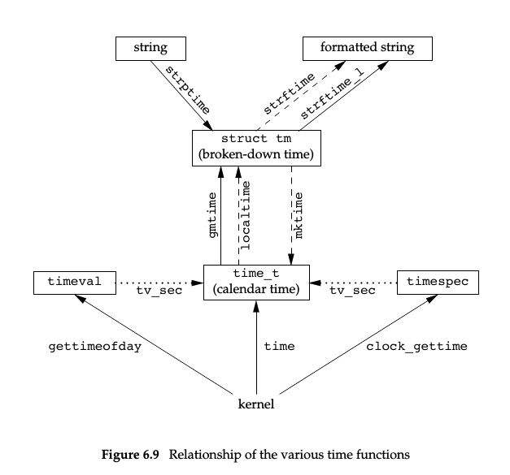

# 系统数据文件和信息
## 1. 引言
UNIX系统正常运行需要大量与系统有关的数据文件; 由于历史原因, 这些数据文件都是ASCII文本文件, 
并且使用标准I/O库读这些文件。不过存在的问题是, 对于较大的系统, 顺序扫描口令文件很浪费时间, 
我们需要用非ASCII文本格式保存文件, 但仍向其他文件格式提供应用程序的接口。
## 2. 口令文件
UNIX系统口令文件包含了下面表格中的各字段, 这些字段包含在< pwd.h >中定义的passwd结构中:

说明 | struct passwd成员 | POSIX.1 | Linux 3.2.0 
---- | ----------------- | ------- | -----------
用户名 | char *pw_name | + | +
加密口令 | char *pw_passwd |  | +
数值用户ID | uid_t pw_uid | + | +
数值组ID | gid_t pw_gid | + | +
注释字段 | char *pw_gecos |  | +
初始工作目录 | char *pw_dir | + | +
初始shell(用户程序) | char *pw_shell | + | +
用户访问类 | char *pw_class |  |
下次更改口令时间 | time_t pw_change |  |
账户有效期时间 | time_t pw_expire |  |

### 函数原型
#### 获取口令文件项的函数

```c
#include<pwd.h>
struct passwd *getpwuid (uid_t uid);
struct passwd *getpwnam (const char *name);
    /* 返回值: 若成功, return 指针; 若出错, return NULL */
```
1. 在给出用户登录名或数值用户ID后, 这两个数就能查看相关项;
2. getpwuid函数由ls(1)程序使用, 用于将i节点中的数字用户ID映射为用户登录名;
在键入登录名时, getpwnam函数由login(1)使用;
3. 两者都返回一个指向passwd结构的指针, 该结构在函数执行时填入信息。不过结构体的内容
在调用任一相关函数时就会被重写;

#### 查看口令文件的函数

```c
#include<pwd.h>
struct passwd *getpwent (void);
    /* 返回值: 若成功, return 指针; 若出错或到达文件尾端, return NULL */
void setpwent (void);
void endpwent (void);
```
1. getpwent返回口令文件的下一个记录项, 同上返回一个由它填好的passwd结构的指针。每次调用
此函数时都重写结构体。本函数对口令文件的各个记录项的安排顺序无要求;
2. 函数setpwent()将getpwent的读写地址重新指向口令文件的开头, 函数endpwent()关闭这些文件

## 3. 阴影口令
为了提高加密口令的安全性, 现在的系统将加密口令存放在另一个通常称为阴影口令(shadow password)的文件中。
该文件至少要包含用户名和加密口令。

说明 | struct spwd成员
---- | --------------
用户登录名 | char *sp_name
加密口令 | char *sp_pwdp
上次更改口令以来经过的时间 | int sp_lstchg
经多少天后允许更改 | int sp_min
要求更改尚余天数 | int sp_max
超期警告天数 | int sp_warn
账户不活动之前尚余天数 | int sp_inact
账户超期天数 | int sp_expire
保留 | unsigned int sp_flag

### 访问阴影口令文件的函数
```c
#include<shadow.h>
struct spwd *getspnam(const char *name);
struct spwd *getspent(void);
    /* 返回值: 若成功, return 指针; 若出错, return NULL */
void setspent(void);
void endspent(void);
```

## 4. 组文件
UNIX组文件包含了以下字段。这些字段包含在< grp.h >所定义的group结构中:

说明 | struct group成员 | Linux 3.2.0 | POSIX.1
---- | ---------------- | ----------- | -------
组名 | char *gr_name | + | +
加密口令 | char *gr_passwd |  | +
数值组ID | int gr_gid | + | +
指向各用户名指针的数组 | char \**gr_mem | + | +

### 查看组名或数值组ID
```c
#include<grp.h>
struct group *getgrgid (gid_t gid);
struct group *getgrnam (const char *name);
    /* 返回值: 若成功, return 指针; 若出错, return NULL */
```
同口令文件的操作函数一样, 两个函数返回的也是指向静态变量的指针, 每次调用函数时都重写静态变量;

#### 搜索整个组文件

```c
#include<grp.h>
struct group *getgrent (void);
    /* 返回值: 若成功, return 指针; 若出错或到达文件尾端, return NULL */
void setgrent (void);
void endgrent (void);
```
作用类似于口令文件的三个操作函数;

## 5. 附属组ID
1983年, 4.2BSD引入了附属组ID的概念。一个用户可以属于多个组, 优点是用户不必显式地经常 
更改组。

### 获取和设置附属组ID的函数
```c
#include<unistd.h>
int getgroups(int gidsetsize, gid_t grouplist[]);
    /* 返回值: 若成功, return 附属组ID的数量; 若出错, return -1 */
#include<grp.h>  /* on Linux */
#include<unistd.h> /* on FreeBSD, Mac OS X, and Solaris */
int setgroups(int ngroups, const gid_t grouplist[]);
#include<grp.h> /* on Linux and Solaris */
#include<unistd.h> /* on FreeBSD and Mac OS X */
int initgroups (const char *username, gid_t basegid);
    /* 返回值: 若成功, return 0; 若出错, return -1 */
```

#### 函数分析
1. getgroups将进程用户的各附属组ID填写到grouplist中, 数量最多为gidsetsize。返回实际的数量;
  当gidsetsize为0时, getgroups返回附属组的数量, 但不修改数组grouplist的内容;
2. setgroups 由root用户调用用于设置附属组ID表。grouplist是组ID数组, ngroups是数组元素数; 
  ngroups &#60; NGROUPS&#95;MAX
3. 通常只有initgroups函数调用setgroups, 所以initgroups也只能由root用户调用, 作用: 读取整个 
  组文件, 确定username的组成员关系; 然后初始化附属组ID表。initgroups也在附属组ID表中包括了
  basegid(username在口令文件中的组ID);

## 6. 实现区别
(略)

## 7. 其他数据文件

说明 | 数据文件 | 头文件 | 结构 | 附加的键搜索函数
---- | -------- | ------ | ---- | ----------------
口令 | /etc/passwd | < pwd.h > | passwd | getpwnam, getpwuid
组 | /etc/group | < grp.h > | group | getgrnam, getgrgid
阴影 | /etc/shadow | < shadow.h > | spwd | getspnam
主机 | /etc/hosts | < netdb.h > | hostent | getnameinfo, getaddrinfo
网络 | /etc/networks | < netdb.h > | netent | getnetbyname, getnetbyaddr
协议 | /etc/protocols | < netdb.h > | protoent | getprotobyname, getprotobyaddr
服务 | /etc/services | < netdb.h > | servent | getservbyname, getservbyaddr

每个数据文件对应3个函数:
1. get函数, 读取下一个记录, 通常返回一个指向静态存储类结构的指针;
2. set函数, 打开文件, 然后重置指针指向文件开头;
3. end函数, 关闭文件。

## 8. 登录账户记录
多数UNIX系统提供两个数据文件: 
- utmp: 记录当前登录到系统的各个用户;
- wtmp: 跟踪各个登录和注销事件;

每次写入文件的是一个utmp结构的二进制记录:
``` c
struct utmp {
    char ut_line[8];  /* tty line: "ttyh0", "ttyd0", "ttyp0", ... */
    char ut_name[8];  /* login name */
    long ut_time;     /* seconds since Epoch */
}
```
_who(1)命令读取utmp, last(1)命令读取wtmp_

## 9. 系统标识
### 返回主机和操作系统相关信息(POSIX.1)
```c
#include<sys/utsname.h>
int uname (struct utsname *name);
    /* 返回值: 若成功, return 非负值; 若出错, return -1 */
```

#### utsname结构
```c
struct utsname {
    char sysname[  ];   /* name of the operating system */
    char nodename[  ];  /* naem of this node */
    char release[  ];   /* current release of operating system */
    char version[  ];   /* current version of this release */
    char machine[  ];   /* name of hardware type */
}
```
uname(1)命令打印utsname结构的信息;

### 返回主机名(TCP/IP主机名)
```c
#include<unistd.h>
int gethostname (char *name, int namelen);
    /* 返回值: 若成功, return 0; 若失败, return -1 */
```
_若name的字符串长度小于等于通过namelen指定的缓冲区长度, 则字符串以null字节结尾; 否则没有这个说明_

hostname(1)命令可用来获取和设置主机名; root用户通过sethostname函数设置主机名

## 10. 时间和日期例程
UNIX的基本时间服务是就算自协调世界时(UTC)以来经过的秒数, 通过数据类型time_t表示。称其为 *日历时间* 
包括了日期和时间; 相比于其他操作系统的区别有:
1. 以协调统一时间而非本地时间计时;
2. 可自动地进行转换;
3. 将日期和时间作为一个量值保存;

### 获取时间函数
#### time函数
```c
#include<time.h>
time_t time (time_t *calptr);
    /* 返回值: 若成功, return 时间值; 若失败, return -1 */
```

#### clock_gettime函数
POSIX1.1的实时扩展增加了对多个系统时钟的支持, SUS V4将这些支持放到了基本组;
通过clockid_t类型进行标示:

clockid_t 标识符 | 选项 | 说明
---------------- | ---- | ----
CLOCK_REALTIME |  | 实时系统时间
CLOCK_MONOTONIC | \_POSIX_MONOTONIC_CLOCK | 不带负跳数的实时系统时间
CLOCK_PROCESS_CPUTIME_ID | \_POSIX_CPUTIME | 调用线程的CPU时间
CLOCK_THREAD_CPUTIME_ID | \_POSIX_THREAD_CPUTIME | 调用进程的CPU时间

```c
#include<sys/times.h>
int clock_gettime(clockid_t clock_id, struct timespec *tsp);
    /* 返回值: 若成功, return 0; 若出错, return -1 */
```
当clockid_t = CLOCK_REALTIME时, clock_gettime的作用和time相同, 不过clock_gettime有更高的 
精度;

#### clock_getres函数
```c
#include<sys/time.h>
int clock_getres (clockid_t clock_id, struct timespec *tsp);
    /* 返回值: 若成功, return 0; 若出错, return -1 */
```
将tsp指向的timespec结构初始化为与clockid_t对应的时钟精度。

#### clock_settime 函数
```c
#include<sys/time.h>
int clock_settime (clockid_t clock_id, const struct timespec *tsp);
    /* 返回值: 若成功: return 0; 若出错, return -1 */
```
对特定的时钟修改时间, 当然在修改时需要适当的特权。

#### gettimeofday 函数(SUS指定, 现已弃用)
```c
#include<sys/time.h>
int clock_settime (struct timeval *restrict tp, void *restrict tzp);
    /* 返回值: 总是返回0 */
```
与time相比有更高的精度, 达到微秒级;

### 时间转换函数
函数localtime和gmtime将日历时间转换为分解的时间, 并放在一个tm结构中:
```c
struct tm {        /* a broken-down time */
    int  tm_sec;   /* seconds after the minute: [0 - 60] */
    int  tm_min;   /* minutes after the hour: [0 - 59] */
    int  tm_hour;  /* hour after midnight: [0 - 23] */
    int  tm_mday;  /* day of the month: [1 - 31] */
    int  tm_mon;   /* months since January: [0 - 11] */
    int  tm_year;  /* years since 1900 */
    int  tm_wday;  /* days since Sunday: [0 - 6] */
    int  tm_yday;  /* days since January 1: [0 - 365] */
    int  tm_isdst; /* daylight saving time flag: <0, 0, >0 */
}
```

各个时间函数之间的关系:



#### localtime函数和gmtime函数
```c
#include<time.h>
struct tm *gmtime (const time_t *calptr);
struct tm *localtime (const time_t *calptr);
    /* 返回值: 若成功, return 指向tm的指针; 若出错, return NULL */
```
两者的区别在于: localtime将日历时间转换为本地时间, gmtime将日历时间转换为协调统一时间的年月日时分秒...

#### mktime函数
```c
#include<time.h>
time_t mktime (struct tm *tmptr);
    /* 返回值: 若成功, return 日历时间; 若出错, return -1 */
```
将本地时间的年月日等变换为日历时间。

#### strftime函数
```c
#include<time.h>
size_t strftime (char *restrict buf, size_t maxsize, const char *format, const struct tm *restrict tmptr);
size_t strftime_l (char *restrict buf, size_t maxsize, const char *format, const struct tm *restrict tmptr, locale_t locale);
    /* 返回值: 若有空间, 返回存入数组的字符数; 若出错, return 0 */
```
一个类似于printf的时间格式化函数。其中strftime_l可以指定区域(参数locale); strftime通过TZ环境变量指定区域

#### strptime函数
```c
#include<time.h>
size_t strptime (char *restrict buf, const char *restrict format, struct tm *restrict tmptr);
    /* 返回值: 指向上次解析的字符的下一个字符的指针; 否则, return NULL */
```
与strftime相对, 一个格式化的将字符串时间转换为分解时间

