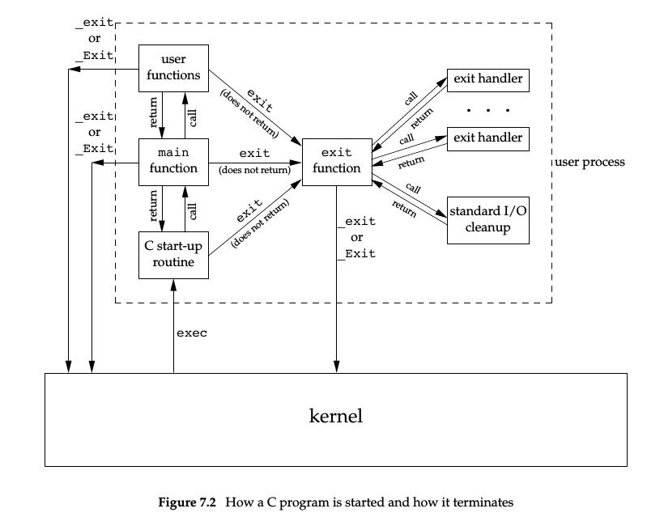
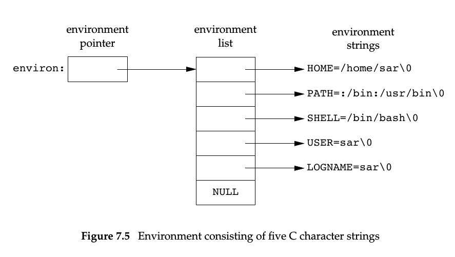
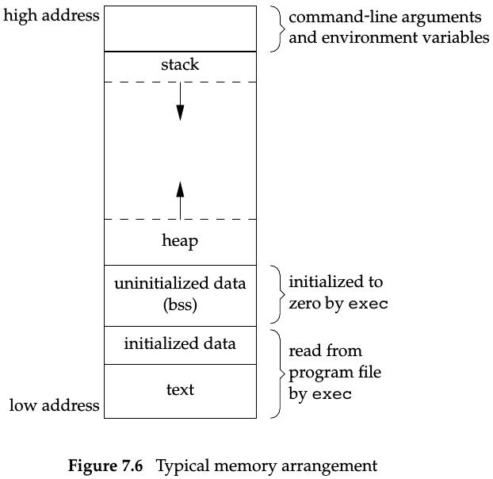

# 进程环境
## 1. main函数 
```c
int main (int argc, char *argv[]);
```
其中, argc是命令行参数的数目; argv是指向参数的各个指针所构成的数组。
调用前main前先调用一个特殊的启动例程。可执行程序文件将此启动例程指定为程序的起始地址--连接编辑器设置,
而连接编辑器则由C编译器调用。

## 2. 进程终止
有8种方式终止进程, 5种为正常终止: 
1. 从main返回;
2. 调用exit;
3. 调用_exit或_Exit;
4. 最后一个线程从启动例程返回;
5. 从最后一个线程调用pthread_exit;
3种异常终止:
1. 调用abort;
2. 接到一个信号;
3. 最后一个线程对取消请求做出响应;

从main返回后立即exit函数, 启动例程以C代码形式表示:
    
    exit (main (argc, argv));

### 1. 退出函数
```c
#include<stdlib.h>
void exit (int status);
void _Exit (int status);
#include<unistd.h>
void _exit (int status);
```
3个退出函数都带一个整型参数, 称为终止状态(exit status)。、
以下情况进程的终止状态未定义:
1. 调用上面3个函数不带终止状态;
2. main执行了一个无返回值的return语句;
3. main没有声明返回类型是整型;

当main的返回类型是整型, 且main执行到最后一条语句返回(隐式返回), 则终止状态为0;

main函数中:
exit(0); == return (0);

### 2. atexit函数
ISO C规定一个进程最多登记32个函数(终止处理程序), 并且由exit自动调用。
atexit用于登记这些函数:
```c
#include<stdlib.h>
int atexit (void (*func)(void));
    /* 返回值: If success, return 0; If failed, return nonzero */
```
exit调用这些函数的顺序与登记顺序相反, 同一函数登记多次也会被调用多次;

C程序是如何启动和终止的:



## 3. 命令行参数
执行一个程序时, 调用exec进程可将命令行参数传递给该程序。

## 4. 环境表
与参数表一样, 环境表也是一个字符指针数组, 其中每个指针包含一个以null结束的C字符串的地址。
全局变量environ包含了指针数组的地址: 
    
    extern char **environ;

其中, environ为环境指针, 指针数组为环境表, 指向的字符串为环境字符串; 具体结构如图:



## 5. C程序的存储空间布局
C语言程序一般由下列几个部分组成:
- 正文段: CPU执行的机器指令部分; 共享但只读;
- 初始化数据段: 全局的已经初始化的变量;
- 未初始化数据段(BSS段): 全局的未初始化的变量;
- 栈: 函数调用产生的信息以及一些自动变量, 还有为被调用的函数的自动和临时变量分配存储空间。
- 堆: 动态存储分配;

*size(1)命令可以查看正文段, 数据段, bss段的长度(字节为单位)*

存储空间布局示意图:



## 6. 共享库(动态链接库)

## 7. 存储空间分配
```c
#include<stdlib.h>
void *malloc(size_t size);
void *calloc (size_t nobj, size_t size);
void *realloc (void *ptr, size_t newsize);
    /* Returns: non-null pointer if OK, NULL on error */
void free (void *ptr);
```
1. malloc, 分配指定字节数的存储区, 初始值不确定;
2. calloc, 为指定数量指定长度的对象分配存储空间, 初始值为0;
3. realloc, 增加或减少以前分配区的长度。增加长度时, 可能需要移动内容;(初始值不确定)

