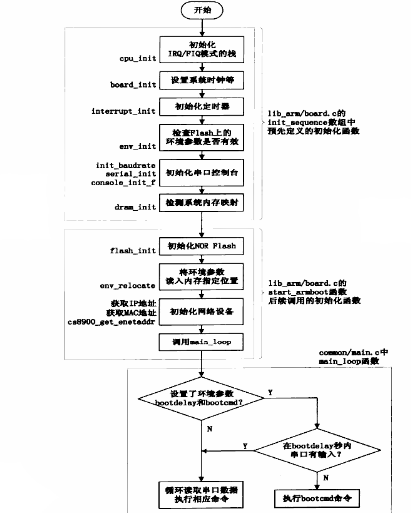

# 实验笔记2
2017-11-06

> 概要: 理清u-boot的编译过程和工作过程, 掌握Linux Kernel的编译过程和文件结构; 根文件系统的过程分析;

(u-boot和kernel的编译和烧录过程在实验笔记1中)
## u-boot (启动内核)
> 具体可以参考u-boot中的README文件: ./README
### 1. Makefile 分析
#### 1. 配置过程: make 100ask24x0_config
具体执行的是:
```
@$(MKCONFIG) $(@:_config=) arm arm920t 100ask24x0 NULL s3c24x0
MKCONFIG := $(SRCTREE)/mkconfig
$(@:_config=) -- 100ask24x0

/* 所以上述命令等效于: */
mkconfig 100ask24x0 arm arm920t 100ask24x0 NULL s3c24x0
```
*所以从Makefile中跳转到mkconfig中继续执行: mkconfig 是一个脚本文件(所以可以自阅)*
**结果** :
1. 确定开发板的名称: BOARD_NAME;
2. 创建到平台/开发板的头文件的连接;
3. 创建顶层Makefile包含的文件include/config.mk;
4. 创建开发板相关的头文件inclue/config.h;

#### 2. 编译过程: make
1. 编译cpu/$(CPU)/start.S;(不同的CPU, 可能还有其他的选项)
2. 对于开发板/平台相关的每个目录, 使用每个目录各自的Makefile生成相应的库;
3. 将前两步编译生成的 \*.o, \*.a 文件按照board/$(BOARDDIR)/config.mk 中指定的代码段起始地址,
  board/$(BOARDDIR)/u-boot.lds 连接脚本进行连接;
4. 将上步生成的ELF格式的u-boot 转换为二进制格式;

### 2. 代码分析
#### 裸板实验的流程(回忆)
1. 初始化
> 1. 关看门狗;
> 2. 初始化时钟;
> 3. 初始化SDRAM;

2. 把程序从NAND FLASH 拷贝到 SDRAM;
3. 设置栈;(后续需要执行C语言程序)
4. 继续执行程序;

#### u-boot 启动流程分析
1. 硬件相关初始化:
> (裸板实验的流程)

2. 设置栈, sp->内存; (然后调用C函数)
  *以上过程可以看cpu/$(CPU)/start.S* 
> ##### 具体分析 (硬件相关初始化) [第一阶段]
> 1. 进入设为管理模式(SVC);
> 2. 关看门狗;
> 3. 屏蔽中断;
> 4. 初始化SDRAM;
> 5. 设置SP;
> 6. 时钟初始化;
> 7. 重定位(程序从FLASH拷到SDRAM)
> 8. 清理BSS段(未初始化的数据)
> 9. 调用start_armboot;

3. 读出内核
> ##### 具体分析
> 1. 初始化NAND FLASH 和 NOR FLASH;
> 2. 能支持FLASH的读和写;
> 3. 环境变量初始化; (默认的 && FLASH上保存的)
> 4. 调用main_loop;(死循环)
> 5. u-boot 命令输入;
>   图示过程:



> ##### 命令实现 run_command()
> 1. 输入字符串(Name);
> 2. Name => 动作 => 函数;
> 3. 命令结构体cmd_tbl_s{name, maxargs, repeatable, func\*, usage, help};
> 4. find_cmd(), 比较输入字符串与命令结构体中的Name;
> > u-boot.lds => \_u_boot_cmd_start; \_u_boot_cmd_end;  
> > .u_boot_cmd -- #define struct_Section \_\_attribute\_\_((unused,section (".u_boot_cmd")))  
> > <Command.h>(include)  
> > \#definn U\_BOOT_CMD (name, maxargs, rep, cmd, usage, help)  
> > cmd_tbl_t \_\_u_boot_cmd\_##name Struct_Section = {#name, maxargs, rep, cmd, usage, help}  
> > comman/Makefile

> 读出内核的命令 nand read.jffs2(这个后缀不需要页对齐) 0x30007FC0 kernel (mtd可见分区)

> 命令等效于 nand read.jffs2 0x30007FC0 0x00060000 0x00200000 

> Flash 存储的内核是 uImage => image\_header + kernel;

> image_header => {ih_load(加载地址), ih\_ep(入口地址)} => kernel可以存放在内存的任意地方

> bootm 命令 => 根据image_header移动kernel到合适的地方(加载地址) => 启动kernel(do\_bootm\_linux)

> do\_bootm\_linux => 设置kernel启动参数 => 跳到入口地址启动kernel(theKernel()函数

> u-boot和kernel数据交互: 在说定的地址以约定的格式, 存放数据。(地址: 0x30000100, 格式 struct tag)  

```c
theKernel (0, bd->bi_arch_number, bd->bi_boot_params);
/* 
 * bd->bi_arch_number -- 机器ID, 用于确定kernel是否支持这款板子(芯片);
 * bd->bi_boot_params -- 入口地址
 */
// armlinux.c
setup_start_tag(bd);
setup_memory_tag (bd);
setup_command_line (bd, commandline);
setup_end_tag (bd);
```

## 内核 (启动应用程序)
### 配置
1. 结果是生成了.config文件;
2. .config里面的配置项有以下文件引用:
> - C源码;(宏来源于 ./include/linux/autoconf.h)
> - 子目录Makefile;
> > obj-y += xxx.o -- xxx.c最终被编译进内核里
> > obj-m += yyy.o -- yyy.c最终被编译成一个模块

> - ./include/config/auto.conf
> - ./include/linux/autoconf.h (基本所有宏定义为1)
3. make uImage 时发生了下列事情:
> - .config  => autoconf.h;
> - .config  => auto.conf
### 分析(./Documentation/kbuild/makefiles.txt)
1. 字目录下的Makefile: 
> - obj-y += yyy.o
> - obj-m += xxx.o

2. make uImage => ./arch/arm/Makefile;
3. uImage <= vmlinux <= $(vmlinux-lds) $(vmlinux-init) $(vmlinux-main) $(kallsyms.o) FORCE
> - vmlinux-init <= $(head-y) $(init-y)
> - vmlinux-main <= $(core-y) $(libs-y) $(drivers-y) $(net-y)
> - vmlinux-lds  <= arch/$(ARCH)/kernel/vmlinux.lds 

### 启动
1. 处理u-boot传递的参数; (arch/arm/kernel/head.S)
> 0. 判断是否支持这个CPU;
> 1. 判断是否支持这个单板; <= u-boot启动内核时传入的参数(机器ID);
> 2. 建立页表;
> 3. 使能MMU;
> 4. 跳转 start_kernel;
2. 挂接根文件系统;
3. 最终目的, 运行应用程序;
  Linux内核启动过程图解:
  .png)
  .png)

```
/* 内核的启动流程 (函数调用) */
start_kernel
	setup_arch              // 解析u-boot传入的启动参数
	setup_command_line      // 解析u_boot传入的启动参数
	parse_early_param
		do_early_param
			From __setup_start To __setup_end 调用early函数
	unknown_bootoption
		obsolete checksetup
			From __setup_start To __setup_end 调用Non early函数
	rest_init
		kernel_init; (创建kernel thread)
			prepare_namespace
				mount_root   // 挂接根文件系统
			init_post
				// 执行应用程序 (打开 /dev/console)
```
**PS:**  
分区的代码在内核中已经写定, 位置在: ./arch/arm/plat-s3c24x0/common-smdk.c
```
struct mtd_partition smdk_default nand_part[]={};
```
## 根文件系统 (应用程序的基础[平台])

0. kernel how to start the first application:
> 1. open ("/dev/console"); (console -- 终端)
> 2. sys\_dup(0); sys_dup(0); (复制文件, 参考系统调用dup())
> 3. run\_init_process();  (可以启动自己的定义, 没指定就是默认) // 参见: ./init/main.c

### busybox -- Linux 一些基础命令的集合;
1. init_main 作用:
> 1. 读取配置文件
> 2. 解析配置文件
> 3. 执行用户(程序)

```c
busy -> init_main
			parse_inittab
				fopen("INITTAB", "r"); //打开配置文件 /etc/inittab 
				//(inittab的说明文档在./examples/inittab)
				new_init_action ();
			run_actions(SYSINIT);
				waitfor (a, 0);           // 执行应用程序, 等待它执行完毕
					run (a);              // 创建子进程process
					waitpid(runpid, &status, 0);  // 等待它结束
				delete_init_action (a);   // 在init_action_list链表里删除
			run_actions(WAIT);
				waitfor (a, 0);           // 执行应用程序, 等待它执行完毕
					run (a);              // 创建子进程process
					waitpid(runpid, &status, 0);  // 等待它结束
				delete_init_action (a);   // 在init_action_list链表里删除
			run_actions(ONCE);
				run (a);              // 创建子进程process
				delete_init_action (a);   // 在init_action_list链表里删除
			while (1) {
				run_actions(RESPAWN);
					if (a->pid == 0) {
						a->pid = run (a);
					}
				run_actions(ASKFIRST);
					if (a->pid == 0) {
						a->pid = run (a);
					}
				wpid = wait(NULL);
				while (wpid > 0){
					a->pid = 0;
				}
			}
/* inittab 的格式:
 * <id>:<runlevels>:<action>:<process>
 * id => /dev/id, 用于终端: stdin, stdout, stderr: printf, scanf, err;
 * runlevels => 应用程序优先级(暂时忽略)
 * action => 执行时机
 * process => 应用程序或程序
 * 从默认的 new_init_action 中推出的配置文件格式:
 *  ::ctrlaltdel:reboot
 *  ::shutdown:umount -a -r
 *  ::restart:init
 *  ::askfirst:~/bin/sh
 *  tty2::askfirst:~/bin/sh
 *  tty3::askfirst:~/bin/sh
 *  tty4::askfirst:~/bin/sh
 *  ::sysinit:/etc/init.d/rcS
 */
	static void new_init_action (int action, const char *command, const char *cons);
/* 1. 创建一个init_action 结构;
 * 2. 把这个结构放入init_action_list 链表
 */
```
#### 最小根文件系统所需的要素

1.  /dev/console ;   /dev/null(当程序不指向标准输入，输出，错误时可以指向NULL)
2.  /etc/inittab
3.  配置文件指定的程序
4.  应用程序: init => busybox
5.  C库(若把BusyBox编译成静态的时候, 不需要C库)

### 制作, 烧写根文件系统; 使用NFS, 编译使用驱动文件

#### 1. 编译, 配置BusyBox[实验版本: 1.7.0]

1. 解压busybox:

   ```shell
   tar xjf busybox-x.x.x.tar.bz2
   cd busybox-x.x.x
   ```

2. 修改Makefile: (新版BusyBox可以在make menuconfig 设置交叉编译)

   ```makefile
   CROSS_COMPILE ?= arm-linux-
   ```

3. make menuconfig:

   ```shell
   Makefile:405: *** mixed implicit and normal rules:deprecated syntax
   Makefile:1242: *** mixed implicit and normal rules:deprecated syntax
   ```

   出现上述情况可参考编译linux kernel 时的解决方案;

4.  make  &  make install: 

   ```makefile
   make install :
   	make CONFIG_PREFIX=/path/from/root install
   ```

5. Complete

#### 2. 构建最小根文件系统

1. 创建/dev/console,  /dev/null

   ```shell
   cd path/to/fs_mini
   mkdir dev
   cd dev
   sudo mknod console c 5 1
   sudo mknod null c 1 3
   ```

2. 构造一个/etc/inittab

   ```shell
   cd path/to/fs_mini
   mkdir etc
   vi(vim) etc/inittab
   	console::askfirst:-/bin/sh
   ```

3. C库

   ```shell
   mkdir -p /path/to/fs_mini/lib
   cd /path/to/gcc-3.4.5-glibc-2.3.6/arm-linux/lib
   cp *.so* /path/to/fs_mini/lib -d (-d 保留链接文件)
   ```

4. 进一步完善: 

   > 创建 proc
   >
   > ```shell
   > cd /path/to/fs_mini
   > mkdir proc
   > echo "::sysinit:/etc/init.d/rcS" >> etc/inittab
   > mkdir etc/init.d; vim etc/init.d/rcS
   > 	mount -t proc none /proc (挂载proc虚拟文件系统,用于收集当前正在运行的程序的信息)
   > 	mount -a (读取/etc/fstab, 根据文件内容挂载)
   > chmod +x etc/init.d/rcS
   > vim etc/fstab
   > 	#参考PC机上的/etc/fstab文件挂载proc
   > 	#device   mount-point  type    options    dump    fsck   order
   > 	proc         /proc     proc    defaults    0       0
   > ```

5. 创建Dev目录: mdev (udev简化版本)[使用方法: 参考文档 -- ./docs/mdev.txt]

   > 1. 修改etc/fstab
   >
   >    ```shell
   >    #device   mount-point  type    options    dump    fsck   order
   >    sysfs       /sys       sysfs   defaults   0        0
   >    tmpfs       /dev       tmpfs   defaults   0        0
   >    ```
   >
   > 2. 修改etc/init.d/rcS
   >
   >    ```shell
   >    mount -a
   >    mkdir /dev/pts
   >    mount -t devpts devpts /dev/pts
   >    echo /sbin/mdev > /proc/sys/kernel/hotplug
   >    mdev -s
   >    ```

6.  Complete

#### 制作映像文件

##### 制作yaffs2映像文件

```shell
cd /path/to/tools
tar xjf yaffs_source_util_larger_small_page_nand.tar.bz2
cd Development_util_ok
cd yaffs2/utils
make
sudo cp mkyaffs2image /usr/local/bin
sudo chmod +x /usr/local/bin/mkyaffs2image
cd path/to/fs_mini; cd ..
mkyaffs2image fs_mini fs_mini.yaffs2
```

##### 制作jffs2映像文件

```shell
# 安装zlib压缩库
cd /path/to/zlib-x.x.x.tar.gz
tar xzf zlib-x.x.x.tar.gz ; cd zlib-x.x.x
./configure --shared --prefix=/usr
make ; sudo make install
# 安装mkfs.jffs2 压缩工具
cd /path/to/mtd-utils-x.x.x.tar.bz2
tar xjf mtd-utils-x.x.x.tar.bz2 ; cd mtd-utils-x.x.x/util
make && sudo make install
# 制作jffs2镜像文件
cd /path/to/fs_mini; cd ..
mkfs.jffs2 -n -s 2048 -e 128KiB -d fs_mini -o fs_mini.jffs2
# -s -- 一页的大小
# -e -- 可擦除块的大小
# 烧写jffs2文件系统镜像时需要强制指定文件系统类型
set bootargs noinitrd root=/dev/mtdblock3 rootfstype=jffs2 ....(其余选项不变)
```

#### nfs的使用 (参考内核文档: ./Documentation/nfsroot.txt)
1. 安装Ubuntu的NFS的服务

```shell
sudo apt-get install nfs-kernel-server (推荐安装了一个: open-iscsi watchdog)
\\ 以防万一都装上吧;
```

2. 设置/etc/exports: 
> 1. 确定你需要挂载的目录: /path/to/dir;
> 2. 修改目录权限: 
>
> ```shell
> sudo chmod -R /path/to/dir
> ```
>
> 3. 进入文件**/etc/exports**输入:
>
> ```shell
> /path/to/dir  *(rw,sync,no_root_squash)
> # 至于选项参考网站 [nfs安装与设置](http://www.cnblogs.com/mchina/archive/2013/01/03/2840040.html)
> ```
>
3. 重启nfs-kernel-server服务:

```shell
sudo /etc/init.d/nfs-kernel-server restart
OR
sudo service nfs-kernel-server restart
```

4. 在本机试挂载:

```shell
sudo mount -t nfs <ipaddr>:<path-to-dir> <target-dir>
```

5. 进入开发板进行挂载:

```shell
mkdir /mnt
mount -t nfs <ipaddr>:<path-to-dir> <target-dir>>
```
6. 解决开机挂载nfs的问题: (进入u-boot启动设置界面[在等待时, 按<Space>进入])

```
set noinitrd root=/dev/nfs nfsroot=[<server-ip>:]<root-dir>[,<nfs-options>] ip=<client-ip>:<server-ip>:<gw-ip>:<netmask>:<hostname>:<device>:<autoconf> init=/linuxrc console=ttySAC0
eg:
# kernel 2.22.6
set bootargs noinitrd root=/dev/nfs nfsroot=192.168.1.25:/home/yjh/WorkSpace/nfs_root/first_fs ip=192.168.1.17:192.168.1.25:192.168.1.1:255.255.255.0::eth0:off init=/linuxrc console=ttySAC0
# kernel 3.4.2
set bootargs noinitrd root=/dev/nfs nfsroot=192.168.1.25:/home/yjh/WorkSpace/nfs_root/new_first_mini ip=192.168.1.17:192.168.1.25:192.168.1.1:255.255.255.0::eth0:off init=/linuxrc console=ttySAC0,115200
// 具体设置以及参数意义可以参考: ./Documentation/nfsroot.txt
save
```

7. 完成
