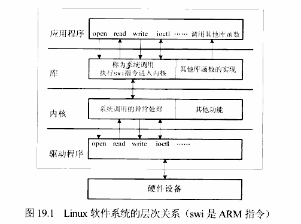
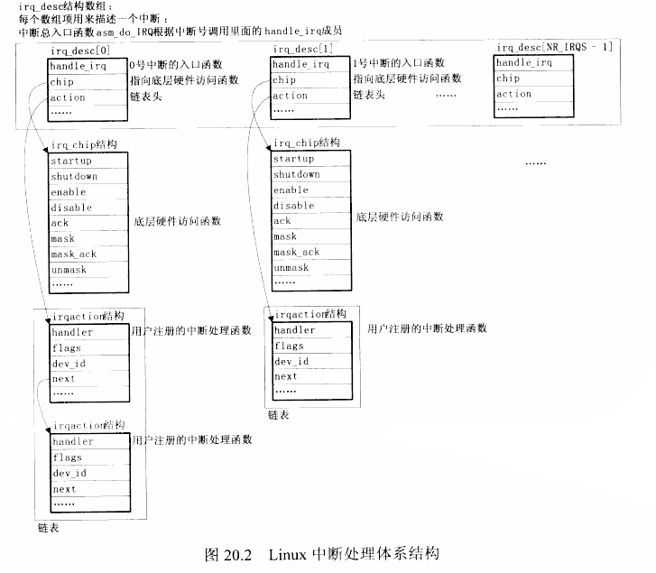

# 实验笔记3

> Date: 2017年11月11日
>
> Statement:  Learning how to write a char device program by myself. 掌握驱动开发的基本流程,  以及一些基本的驱动开发思想;

## 1. 基本概念

### Application, C library, kernel and the Driver



## 2. 实验过程中的所感

> 因为这一次的学习相比于暑假期间的教材多了很多, 具有了更多的参考。所以这次的笔记没有以往那么多。主要内容在字符设备驱动的思维导图之中。
>
> 时间 ---- 2017年11月13日

1. 在没有看视频的情况下, 参考以前的代码, 自己独立完成视频教程12课前3节的内容。GPIO方面的硬件操作简单, 字符设备驱动的基本框架也已经完成了。
2. ​

## 3. 知识点

1. 异常和中断的区别:

   > 1. 中断: 指系统停止当前正在运行的程序而转向其他服务，可能是因为优先级高的请求服务了，或者是因为人为安排中断。中断是属于正常现象。主要由CPU以外的事件引起的中断，如I/O中断、时钟中断、控制台中断等。
   > 2. 异常:  是由于软件错误而引起的来自CPU的内部事件或程序执行中的事件引起的过程。如由于CPU本身故障、程序故障和请求系统服务的指令引起的中断等。

2. 中断的处理过程

   > 1. 外部中断源触发(按键按下, 或其他);
   >
   > 2. CPU 接受中断,  调到异常向量入口执行;
   >
   > 3. 执行某个函数:
   >
   >    > 1. 保存被中断的现场(被中断前, 寄存器的值还有处理器的状态);
   >    > 2. 执行中断处理函数, (类似于按键触发之后, 指定的LED灯亮);
   >    > 3. 恢复中断现场;‘
   >
   >    **以下是中断处理过程, 上面的过程是ARM结构对于异常处理的结构**
   >
   > 4. 分辨 是哪一个中断;
   >
   > 5. 调用中断处理函数;
   >
   > 6. 清中断

3.  ARM体系CPU的7种工作模式

   > 1. 用户模式(usr);
   > 2. 快速中断模式(fiq);
   > 3. 中断模式(irq);
   > 4. 管理模式(svc);
   > 5. 数据访问终止模式(abt);
   > 6. 系统模式(sys);
   > 7. 未定义指令中止模式(und);

4.  Linux异常处理结构

   > 0. trap_init (./arch/arm/kernel/traps.c) 设置各种异常处理向量。(即固定位置异常处理指令, 其中基地址为0xffff0000。[ARM架构异常向量基地址有0x00000000和0xffff0000, linux内核中习惯使用后者])
   >
   >
   > 1. trap_init 构造异常向量;
   > 2. vector_irq(用宏实现); --- (执行的就是中断处理的过程) ;

5.  Linux中断处理结构 

   > ```c
   > asm_do_TRQ();
   > 	desc = irq_desc[irq];  // irq 中断号, 有宏定义指定
   >  	desc->handle_irq();	// 处理中断
   > 	handle_irq() -> handle_edge_irq()[example]
   > 		desc->chip->ack(irq);     // 清中断
   > 		handle_IRQ_event();       // 中断处理
   > 			action -> handler();  // handler即为自己的中断处理函数
   > struct irq_desc {
   >   handler_irq;    // 中断触发类型(边沿触发...)
   >   chip;     // 芯片相关的底层操作;
   >   action;   
   > };
   > request_irq(); 
   > /*  irq -- 中断号
   >  * handler -- 处理函数
   >  * irqflags -- 触发类型标志(上升沿触发...)
   >  * devname -- 设备名字
   >  * devid -- 设备ID
   >  */
   > 	struct irqaction atcion;  // 分配结构
   > 	setup_irq(irq, action); // 设置IRQ;
   > 		irq_desc[irq]->action = action;	   // 放入指定链表结构
   > 		desc->chip->settype ( );        // 设置引脚
   > 		desc->chip->startup/enable( );  // 使能中断
   > free_irq (irq, devid);
   > 	// 从irq_desc[irq]->action 移除 action
   > 	// 禁止中断(非共享中断)
   > ```
   >
   > 


